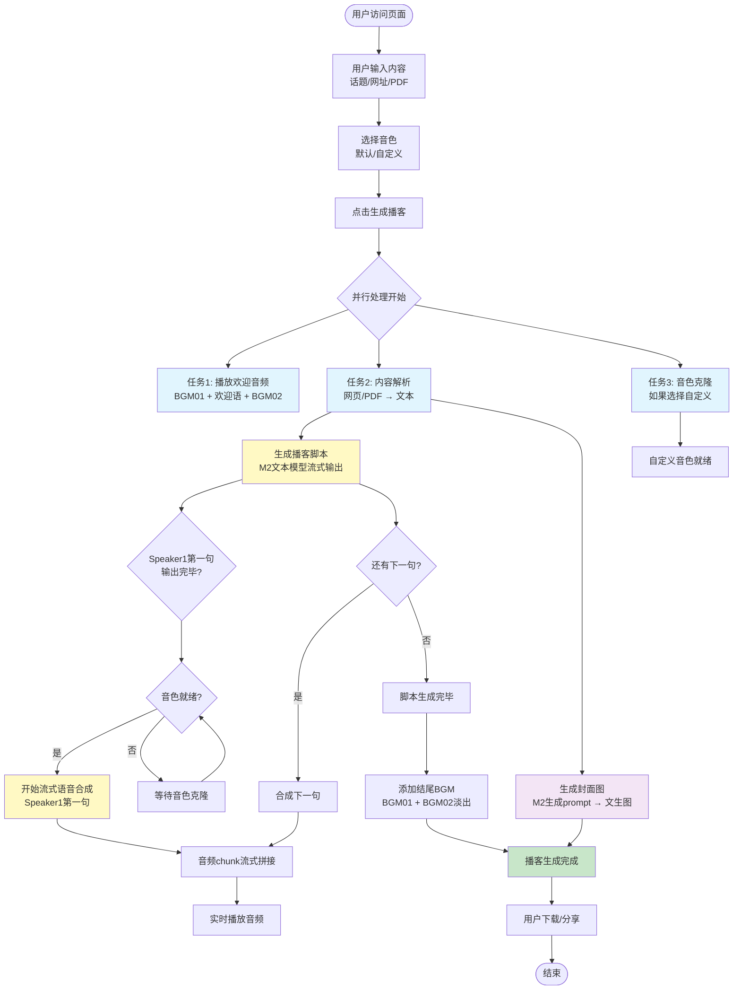
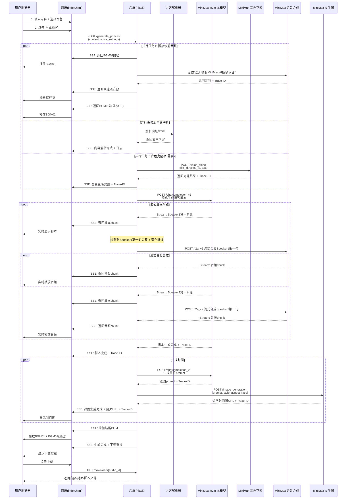

# 产品需求文档 (PRD) - MiniMax AI 播客生成器

**文档版本**: V1.0
**创建日期**: 2025-10-18
**产品状态**: MVP 设计阶段
**设计师**: Claude (AI 首席产品设计师)
**目标用户**: 个人博主、内容创作者

---

## 📋 目录

1. [产品路线图](#产品路线图)
2. [MVP 原型设计](#mvp-原型设计)
3. [架构设计蓝图](#架构设计蓝图)
4. [实施计划](#实施计划)

---

## 🎯 产品路线图

### 核心目标 (Mission)
打造一款极致高效的 AI 播客生成工具，让个人博主在 3 分钟内将任意材料转化为专业级播客内容。

### 用户画像 (Persona)
**主要用户**: 个人博主、内容创作者
- **使用频率**: 每周 1-2 次
- **核心痛点**:
  - 播客制作耗时长，需要策划、录制、剪辑
  - 缺乏专业的播客制作技能和设备
  - 需要快速将文字/网页内容转化为音频形式
  - 希望内容生动有趣，而非机械朗读
- **期望价值**:
  - 极速生成（3-5分钟内完成）
  - 自然对话效果（非机械播报）
  - 操作简单，零学习成本
  - 可自定义音色，体现个性

---

### V1: 最小可行产品 (MVP)

#### 核心功能清单

##### 1. 内容输入模块
- [ ] 支持话题文本输入（纯文本框）
- [ ] 支持网址链接输入并自动解析
- [ ] 支持 PDF 文件上传并提取文本
- [ ] 支持混合输入（文本+网址+PDF 任意组合）
- [ ] 内容解析进度的详细日志展示
- [ ] 解析失败时的友好错误提示和重试机制

##### 2. 音色选择模块
- [ ] 提供默认音色选择（Mini 女声 + Max 男声）
- [ ] 支持自定义音色选项（最多 2 个）
- [ ] 浏览器录音功能（20 秒自动停止）
- [ ] 音频文件上传（支持常见格式，建议 20 秒）
- [ ] 自定义音色的即时克隆（调用 MiniMax Voice Clone API）
- [ ] Voice ID 自动生成与校验（字母开头+随机数，确保唯一性）

##### 3. 播客生成核心流程
- [ ] **即时播放欢迎音频**: 提交后立即播放 BGM01 → "欢迎收听 MiniMax AI 播客节目"（Speaker2 音色）→ BGM02（1s 淡出）
- [ ] **并行内容解析**: 网页/PDF 解析与音色克隆同步进行
- [ ] **流式脚本生成**: 调用 M2 文本模型，实时显示生成的对话脚本
- [ ] **智能语音合成**:
  - Speaker1 第一句话输出完毕 + 音色就绪后，立即合成该句
  - 流式生成音频 chunk，实时拼接到播放队列
  - 实现边生成边播放的无缝体验
- [ ] **播客封面生成**: 基于内容生成图片 prompt，调用 MiniMax 文生图（漫画风格，1:1 比例）
- [ ] **结尾音乐**: 在播客末尾自动添加 BGM1 + BGM2（淡出）

##### 4. 用户界面与交互
- [ ] 单页应用设计，所有步骤在同一页面动态展示
- [ ] 简洁播放器（播放/暂停/进度条）
- [ ] 实时进度反馈:
  - 文字描述当前步骤（"正在解析材料..."、"正在生成对话脚本..."）
  - 可折叠的详细日志面板（显示每步详细信息）
  - 页面底部浅灰色 Trace ID 展示区（显示所有 API 调用的 Trace ID）
- [ ] Airbnb 风格的清新 UI 设计
- [ ] 响应式布局，适配不同屏幕

##### 5. 下载与分享
- [ ] 下载完整播客音频（MP3 格式）
- [ ] 下载播客封面图（PNG/JPG 格式）
- [ ] 下载播客脚本文本（TXT 格式）

##### 6. 可追溯性与调试
- [ ] 所有 MiniMax API 调用显示 Trace ID
- [ ] 每完成一步立即显示对应的 Trace ID
- [ ] Trace ID 按时间顺序展示，方便问题定位

---

### V2 及以后版本 (Future Releases)

#### V2 增强功能
- [ ] **二次编辑能力**:
  - 重新生成播客封面
  - 调整某个 Speaker 的对话风格（如"更幽默一点"）
  - 替换 Speaker 音色为新的 Voice ID
  - 修改部分脚本内容并重新合成

- [ ] **自由对话功能**:
  - 基于生成的播客内容，与任一 Speaker 进行自由提问
  - Speaker 基于解析的材料给出自然、准确的回答
  - 对话内容可导出为音频

#### V3 及后续
- [ ] 播客模板系统（专业分析、娱乐吐槽、深度访谈等风格）
- [ ] 支持 3 人或多人播客
- [ ] 背景音乐智能混音（自动调节对话与 BGM 音量）
- [ ] 播客系列管理（保存历史、创建专辑）
- [ ] 视频播客生成（自动配图/字幕）
- [ ] 多语言支持
- [ ] 云端部署版本

---

### 关键业务逻辑 (Business Rules - MVP)

#### 1. 内容处理规则
- 混合输入时，AI 完全融合所有材料，生成统一的播客内容
- 网址解析失败时，允许用户重新输入或修正，无需清空其他输入
- PDF 仅支持文本型 PDF，扫描版会友好提示不支持

#### 2. 音色处理规则
- 自定义音色仅当次使用，不持久化保存
- Voice ID 生成规则：首字母 + 随机标识 + 随机数（如 `customVoice_a1b2c3_123456`）
- 音色克隆与内容解析并行，但语音合成必须等待音色就绪

#### 3. 生成时长规则
- 播客时长固定为 3-5 分钟
- AI 根据材料丰富度自动调整对话密度

#### 4. 对话风格规则
- 固定采用轻松幽默风格
- 对话文本自然，包含重复、语气词、自然停顿等真人对话特征
- Speaker1 和 Speaker2 角色分工明确（如一个引导话题，一个深度分析）

#### 5. 流式播放规则
- 提交后立即播放欢迎 BGM + 介绍
- 脚本生成时流式显示
- Speaker1 第一句话生成完毕 → 立即开始合成 → 生成的 chunk 实时拼接到播放队列
- 整体体验：用户几乎无等待，始终有内容在播放

#### 6. 错误处理规则
- 任何环节失败显示详细错误信息和 Trace ID
- 允许单独重试失败步骤，无需从头开始
- 超时时间设定：网页解析 30s，音色克隆 60s，脚本生成 120s

---

### 数据契约 (Data Contract - MVP)

#### 输入数据
```json
{
  "content": {
    "text": "string | null",           // 话题文本
    "url": "string | null",            // 网址链接
    "pdf_file": "file | null"          // PDF 文件
  },
  "voice_settings": {
    "speaker1": {
      "type": "default | custom",      // 音色类型
      "voice_id": "string",            // 音色 ID（默认或自定义）
      "audio_file": "file | null"      // 自定义音色的音频文件
    },
    "speaker2": {
      "type": "default | custom",
      "voice_id": "string",
      "audio_file": "file | null"
    }
  }
}
```

#### 输出数据
```json
{
  "podcast": {
    "audio_url": "string",             // 完整播客音频下载链接
    "cover_image_url": "string",       // 播客封面图下载链接
    "script": "string",                // 播客脚本文本
    "duration": "number",              // 播客时长（秒）
    "trace_ids": {
      "content_parsing": "string",     // 内容解析 Trace ID
      "voice_clone_speaker1": "string | null",  // Speaker1 音色克隆 Trace ID
      "voice_clone_speaker2": "string | null",  // Speaker2 音色克隆 Trace ID
      "script_generation": "string",   // 脚本生成 Trace ID
      "tts_calls": ["string"],         // 所有语音合成 Trace ID 列表
      "cover_generation": "string"     // 封面生成 Trace ID
    }
  },
  "status": {
    "current_step": "string",          // 当前步骤描述
    "progress": "number",              // 进度百分比（0-100）
    "is_complete": "boolean",          // 是否完成
    "error": "string | null"           // 错误信息（如果有）
  }
}
```

---

## 🎨 MVP 原型设计

### 选定方案: A - 极简单栏式

**设计理念**: 所有功能在一个页面纵向排列，用户滚动即可看到全部内容。清晰的分块设计，逻辑流程自上而下。

#### 视觉布局

```
┌─────────────────────────────────────────────────────────────┐
│                  🎙️ MiniMax AI 播客生成器                    │
│                                                               │
│  ┌─────────────────────────────────────────────────────┐    │
│  │  📝 输入内容                                          │    │
│  │  ┌──────────┐ ┌──────────┐ ┌──────────┐             │    │
│  │  │  话题文本 │ │  网址链接 │ │ 上传 PDF │             │    │
│  │  └──────────┘ └──────────┘ └──────────┘             │    │
│  │  ┌──────────────────────────────────────┐           │    │
│  │  │ 输入你想讨论的话题...                 │           │    │
│  │  └──────────────────────────────────────┘           │    │
│  └─────────────────────────────────────────────────────┘    │
│                                                               │
│  ┌─────────────────────────────────────────────────────┐    │
│  │  🎤 选择音色                                          │    │
│  │  Speaker 1: ◉ Mini(女声)  ○ Max(男声)  ☐ 自定义      │    │
│  │  Speaker 2: ○ Mini(女声)  ◉ Max(男声)  ☐ 自定义      │    │
│  │                                                       │    │
│  │  [如选择自定义，显示录音/上传按钮]                     │    │
│  └─────────────────────────────────────────────────────┘    │
│                                                               │
│  ┌───────────────────────────────────────┐                   │
│  │      🚀 开始生成播客（3-5分钟）        │                   │
│  └───────────────────────────────────────┘                   │
│                                                               │
│  ┌─────────────────────────────────────────────────────┐    │
│  │  🎧 播客播放器                                        │    │
│  │  ┌────────────────────────────────────────┐         │    │
│  │  │ ▶️  ━━━━━━━━━●━━━━━━━━  3:24 / 5:00   │         │    │
│  │  └────────────────────────────────────────┘         │    │
│  │                                                       │    │
│  │  📄 对话脚本（实时生成中...）                         │    │
│  │  ┌──────────────────────────────────────┐           │    │
│  │  │ Speaker1: 欢迎大家来到 AI 播客...     │ ⬇展开    │    │
│  │  │ Speaker2: 大家好，我是 Mini...        │           │    │
│  │  └──────────────────────────────────────┘           │    │
│  │                                                       │    │
│  │  🖼️ 播客封面                                          │    │
│  │  [封面图片缩略图]                                     │    │
│  │                                                       │    │
│  │  ⬇️  下载音频  |  下载封面  |  下载脚本                │    │
│  └─────────────────────────────────────────────────────┘    │
│                                                               │
│  ┌─────────────────────────────────────────────────────┐    │
│  │  🔍 详细日志 (点击展开)                              │    │
│  │  Trace ID: xxx-xxx-xxx (内容解析)                     │    │
│  │  Trace ID: xxx-xxx-xxx (脚本生成)                     │    │
│  └─────────────────────────────────────────────────────┘    │
└─────────────────────────────────────────────────────────────┘
```

#### UI 设计规范

##### 色彩方案（Airbnb 风格）
- **主色**: `#FF5A5F`（珊瑚红，用于主按钮和强调）
- **辅助色**: `#00A699`（青绿，用于成功状态）
- **背景色**: `#FFFFFF`（纯白）
- **次级背景**: `#F7F7F7`（浅灰，用于卡片背景）
- **文字色**: `#484848`（深灰，主文本）
- **次级文字**: `#767676`（中灰，辅助文本）
- **边框色**: `#EBEBEB`（浅灰边框）
- **Trace ID 区域**: `#F0F0F0`（浅灰底，`#999999` 文字）

##### 字体规范
- **标题**: `Source Sans Pro`, 24px, Bold
- **副标题**: `Source Sans Pro`, 18px, Semibold
- **正文**: `Source Sans Pro`, 14px, Regular
- **小字**: `Source Sans Pro`, 12px, Regular

##### 间距与圆角
- **卡片圆角**: 12px
- **按钮圆角**: 8px
- **输入框圆角**: 4px
- **卡片内边距**: 24px
- **卡片间距**: 20px

##### 交互动效
- **按钮悬停**: 0.2s ease-in-out，阴影加深
- **卡片展开**: 0.3s cubic-bezier(0.4, 0, 0.2, 1)
- **播放器进度**: 0.1s linear

---

## 🏗️ 架构设计蓝图

### 1. 核心流程图

#### 1.1 整体业务流程



#### 1.2 API 调用时序图



---

### 2. 组件交互说明

#### 2.1 项目文件结构

```
ai_podcast_v2/
├── backend/
│   ├── app.py                    # Flask 后端主文件（需修改）
│   ├── audio_utils.py            # 音频处理工具（需修改）
│   ├── content_parser.py         # 内容解析模块（新增）
│   ├── minimax_client.py         # MiniMax API 客户端（新增）
│   ├── voice_manager.py          # 音色管理模块（新增）
│   ├── podcast_generator.py     # 播客生成核心逻辑（新增）
│   ├── config.py                 # 配置文件（新增）
│   ├── uploads/                  # 上传文件目录
│   └── outputs/                  # 生成文件目录
├── static/
│   ├── bgm01.wav                 # 欢迎 BGM（开场）
│   └── bgm02.wav                 # 欢迎 BGM（结尾淡出）
├── index.html                    # 前端页面（需重新设计）
├── requirements.txt              # Python 依赖
├── start.sh                      # 启动脚本
└── PRD.md                        # 本文档
```

#### 2.2 模块调用关系

```
┌─────────────────────────────────────────────────────────────┐
│                        Frontend (index.html)                 │
│  - 用户交互界面                                               │
│  - SSE 事件监听                                               │
│  - 音频流式播放                                               │
│  - Trace ID 展示                                              │
└───────────────────────────┬─────────────────────────────────┘
                            │ HTTP/SSE
┌───────────────────────────▼─────────────────────────────────┐
│                    Backend (app.py)                          │
│  - Flask 路由                                                 │
│  - SSE 流式响应                                               │
│  - 任务调度                                                   │
└─────┬─────────┬─────────┬─────────┬─────────┬───────────────┘
      │         │         │         │         │
      │         │         │         │         │
┌─────▼──┐ ┌───▼────┐ ┌──▼─────┐ ┌▼────────┐ ┌▼──────────┐
│content_│ │voice_  │ │podcast_│ │minimax_ │ │audio_     │
│parser  │ │manager │ │generator│ │client   │ │utils      │
│        │ │        │ │        │ │         │ │           │
│- 网页  │ │- Voice │ │- 并行  │ │- M2文本 │ │- BGM拼接  │
│  解析  │ │  ID    │ │  任务  │ │- TTS    │ │- 淡入淡出 │
│- PDF   │ │  生成  │ │  调度  │ │- 音色   │ │- 格式转换 │
│  解析  │ │- 克隆  │ │- 流式  │ │  克隆   │ │           │
│- 日志  │ │  管理  │ │  同步  │ │- 文生图 │ │           │
│        │ │        │ │        │ │- Trace  │ │           │
│        │ │        │ │        │ │  ID     │ │           │
└────────┘ └────────┘ └────────┘ └────┬────┘ └───────────┘
                                       │
                           ┌───────────▼───────────┐
                           │   MiniMax API         │
                           │  - M2-preview-1004    │
                           │  - speech-2.5-hd      │
                           │  - voice_clone        │
                           │  - image-01-live      │
                           └───────────────────────┘
```

#### 2.3 关键模块职责

| 模块 | 职责 | 输入 | 输出 |
|------|------|------|------|
| **app.py** | Flask 路由、SSE 推送、任务调度 | HTTP 请求 | SSE 流式响应 |
| **content_parser.py** | 解析网页/PDF，提取文本 | URL/PDF 文件 | 文本内容 + 日志 |
| **voice_manager.py** | 生成 Voice ID，调用音色克隆 | 音频文件 | Voice ID + Trace ID |
| **podcast_generator.py** | 协调并行任务，流式生成播客 | 文本 + Voice ID | 音频 + 脚本 + 封面 |
| **minimax_client.py** | 封装所有 MiniMax API 调用 | API 参数 | 响应数据 + Trace ID |
| **audio_utils.py** | 音频拼接、格式转换、淡入淡出 | 音频文件列表 | 合成后的音频 |
| **config.py** | 配置管理（API Key、路径等） | - | 配置常量 |

---

### 3. 技术选型与风险

#### 3.1 核心技术栈

| 技术模块 | 选型 | 理由 |
|---------|------|------|
| **后端框架** | Flask | 轻量级，易于快速开发，支持 SSE 流式响应 |
| **流式通信** | Server-Sent Events (SSE) | 单向推送，适合流式内容传输，浏览器原生支持 |
| **并行处理** | Python `threading` + `asyncio` | 并行处理解析、克隆、欢迎音频任务 |
| **网页解析** | BeautifulSoup4 (主) + Playwright (备选) | BeautifulSoup 快速简单，Playwright 处理动态网页 |
| **PDF 解析** | PyPDF2 (主) + pdfplumber (备选) | PyPDF2 轻量，pdfplumber 支持复杂表格 |
| **音频处理** | pydub + ffmpeg | 音频拼接、格式转换、淡入淡出 |
| **前端** | Vanilla JS + HTML5 Audio API | 无框架依赖，轻量高效，流式音频播放 |

#### 3.2 关键算法

##### 算法 1: 流式脚本与语音同步生成
```python
# 伪代码
def stream_podcast_generation():
    script_buffer = []
    current_speaker = None
    current_sentence = ""

    # 流式接收脚本
    for chunk in m2_text_stream:
        current_sentence += chunk

        # 检测到完整句子（以换行或标点判断）
        if is_complete_sentence(current_sentence):
            speaker, text = parse_speaker_text(current_sentence)

            # 如果是新的 speaker，立即合成上一句
            if speaker != current_speaker and current_sentence:
                # 异步调用 TTS 流式合成
                asyncio.create_task(
                    stream_tts_synthesis(current_speaker, current_sentence)
                )

            current_speaker = speaker
            current_sentence = ""
```

##### 算法 2: Voice ID 生成与校验
```python
def generate_voice_id(prefix="customVoice"):
    import random, string
    # 首字母 + 前缀 + 随机字符串 + 随机数字
    random_str = ''.join(random.choices(string.ascii_lowercase + string.digits, k=8))
    random_num = random.randint(100000, 999999)
    voice_id = f"{prefix}_{random_str}_{random_num}"

    # 校验规则
    assert len(voice_id) >= 8 and len(voice_id) <= 256
    assert voice_id[0].isalpha()
    assert voice_id[-1] not in ['-', '_']

    return voice_id
```

##### 算法 3: 音频流式拼接与播放
```javascript
// 前端伪代码
class StreamingAudioPlayer {
    constructor() {
        this.audioQueue = [];
        this.mediaSource = new MediaSource();
        this.audioElement.src = URL.createObjectURL(this.mediaSource);
    }

    onAudioChunk(chunk) {
        // 将 chunk 添加到队列
        this.audioQueue.push(chunk);

        // 如果当前没有播放，立即播放
        if (this.audioElement.paused) {
            this.playNextChunk();
        }
    }

    playNextChunk() {
        if (this.audioQueue.length > 0) {
            const chunk = this.audioQueue.shift();
            this.sourceBuffer.appendBuffer(chunk);
        }
    }
}
```

#### 3.3 潜在技术风险与应对

| 风险 | 影响 | 概率 | 应对策略 |
|------|------|------|----------|
| **网页解析失败（反爬虫）** | 无法获取内容 | 中 | 1. 使用 Playwright 处理动态网页<br/>2. 提供友好错误提示，引导用户复制文本输入 |
| **流式音频播放卡顿** | 用户体验差 | 中 | 1. 使用 MediaSource API 进行缓冲管理<br/>2. 增加欢迎音频缓冲时间 |
| **音色克隆耗时过长** | 阻塞播客生成 | 低 | 1. 显示明确的等待提示<br/>2. 允许用户取消并使用默认音色 |
| **TTS API 限流** | 生成中断 | 低 | 1. 实现指数退避重试<br/>2. 显示 Trace ID 方便排查 |
| **浏览器兼容性（录音）** | 无法录音 | 中 | 1. 检测浏览器支持情况<br/>2. 提供上传音频备选方案 |
| **PDF 扫描版无法解析** | 无法提取文本 | 中 | 1. 提前检测 PDF 类型<br/>2. 友好提示不支持扫描版 |
| **并发 API 调用超限** | 请求失败 | 低 | 1. 限制最大并发数<br/>2. 队列化请求 |

#### 3.4 性能优化策略

1. **并行处理优化**:
   - 内容解析、音色克隆、欢迎音频同时进行
   - 预计节省 30-60 秒

2. **流式处理优化**:
   - 脚本生成与语音合成并行（句级别）
   - 用户感知延迟 < 5 秒

3. **缓存策略**:
   - BGM 文件前端缓存
   - 默认音色 Voice ID 本地存储

4. **网络优化**:
   - SSE 长连接减少握手开销
   - 音频 chunk 大小优化（建议 4-8KB）

---

## 📅 实施计划

### Phase 1: 基础架构搭建（1-2 天）
- [ ] 创建新模块文件（content_parser.py, minimax_client.py, voice_manager.py, podcast_generator.py, config.py）
- [ ] 配置 API Key 和常量
- [ ] 实现 MiniMax API 客户端基础封装
- [ ] 测试 SSE 流式响应

### Phase 2: 核心功能开发（3-4 天）
- [ ] 实现内容解析模块（网页 + PDF）
- [ ] 实现音色管理与克隆
- [ ] 实现流式脚本生成
- [ ] 实现流式语音合成
- [ ] 实现音频拼接与 BGM 处理
- [ ] 实现封面图生成

### Phase 3: 前端 UI 开发（2-3 天）
- [ ] 按照方案 A 重新设计 HTML 布局
- [ ] 实现 Airbnb 风格 CSS
- [ ] 实现 SSE 事件监听
- [ ] 实现音频流式播放
- [ ] 实现 Trace ID 展示
- [ ] 实现下载功能

### Phase 4: 集成测试与优化（2-3 天）
- [ ] 端到端测试（话题/网址/PDF）
- [ ] 测试音色克隆流程
- [ ] 测试流式播放体验
- [ ] 错误处理与重试机制测试
- [ ] 性能优化（并行任务、缓冲管理）
- [ ] UI/UX 细节打磨

### Phase 5: 部署与文档（1 天）
- [ ] 完善项目文档
- [ ] 准备演示案例
- [ ] 部署到测试环境
- [ ] 收集用户反馈

**预计总时长**: 9-13 天

---

## 📊 成功指标

### MVP 验收标准
- [ ] 用户可在 5 分钟内完成播客生成（从输入到下载）
- [ ] 播客音质清晰，对话自然流畅
- [ ] 流式播放无明显卡顿（缓冲时间 < 3 秒）
- [ ] 所有 API 调用都显示 Trace ID
- [ ] 错误处理完善，用户可重试失败步骤
- [ ] UI 符合 Airbnb 设计规范，响应式布局

### 关键性能指标（KPI）
- **生成速度**: 平均 3-5 分钟完成 3-5 分钟播客
- **成功率**: > 90% 的请求成功生成播客
- **用户满意度**: 播客质量评分 > 4.0/5.0
- **错误恢复**: 90% 的错误可通过重试解决

---

## 🔮 未来展望

本 MVP 版本是产品的起点，我们的长期愿景是：

1. **成为个人博主的播客制作利器**，将播客制作门槛降低到零
2. **支持多样化内容形式**，从纯音频到视频播客
3. **构建播客社区**，让用户可以分享、交流播客内容
4. **AI 能力持续升级**，更自然的对话、更丰富的风格

---

**文档结束**

本文档将随着产品迭代持续更新。如有疑问或建议，请联系产品团队。

🎙️ 让我们一起打造最好用的 AI 播客生成工具！
